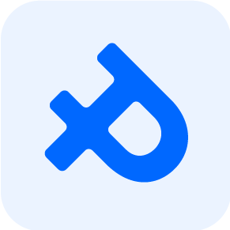

<!-- Improved compatibility of Augšup link: See: https://github.com/othneildrew/Best-README-Template/pull/73 -->

<a name="readme-top"></a>

<!--
*** Thanks for checking out the Best-README-Template. If you have a suggestion
*** that would make this better, please fork the repo and create a pull request
*** or simply open an issue with the tag "enhancement".
*** Don't forget to give the project a star!
*** Thanks again! Now go create something AMAZING! :D
-->

<!-- PROJECT SHIELDS -->
<!--
*** I'm using markdown "reference style" links for readability.
*** Reference links are enclosed in brackets [ ] instead of parentheses ( ).
*** See the bottom of this document for the declaration of the reference variables
*** for contributors-url, forks-url, etc. This is an optional, concise syntax you may use.
*** https://www.markdownguide.org/basic-syntax/#reference-style-links
-->

<!-- PROJECT LOGO -->
<br />
<div align="center">
  <a href="https://github.com/vFar/piffdeals">
    
  </a>

<h3 align="center">Piffdeals</h3>

  <p align="center">
    Preču mazumtirdzniecības e-veikals
    <br />
    <a href="https://github.com/vFar/piffdeals/tree/main/DocumentationOther"><strong>Dokumentācija »</strong></a>
    <br />
  </p>
</div>

<!-- TABLE OF CONTENTS -->
<details>
  <summary>Saturs</summary>
  <ol>
    <li>
      <a href="#about-the-project">Par Projektu</a>
      <ul>
        <li><a href="#built-with">Lietotie Rīki</a></li>
      </ul>
    </li>
    <li>
      <a href="#getting-started">Uzsākšana</a>
      <ul>
        <li><a href="#prerequisites">Priekšnosacījumi</a></li>
        <li><a href="#installation">Uzstādīšana</a></li>
      </ul>
    </li>
  </ol>
</details>

<!-- ABOUT THE PROJECT -->

### Izmantotie Rīki

-   [![Vue][Vue.js]][Vue-url]
-   [![Laravel][Laravel.com]][Laravel-url]
-   [![NodeJS][Nodejs.org]][NodeJS-url]
-   [![Composer][getcomposer.org]][Composer-url]
-   [![ViteJS][vitejs.dev]][ViteJS-url]
-   [![TailwindCSS][tailwindcss.com]][TailwindCSS-url]
-   [![MySQL][mysql.com]][MySQL-url]
-   [![InertiaJS][inertiajs.com]][InertiaJS-url]
-   [![Ziggy][https://github.com/tighten/ziggy]][Ziggy-url]

<p align="right">(<a href="#readme-top">Augšup</a>)</p>

<!-- GETTING STARTED -->

## Uzsākšana

Lai izveidotu un palaistu lokālu kopiju, tad jāizpilda šie nepieciešamie soļi

### Priekšnosacījumi

Nepieciešamie darbības soļi, lai lokāli uzsāktu projektu.

-   npm
    ```sh
    npm install
    ```

### Uzstādīšana

1. Klonēt repozitoriju
    ```sh
    git clone https://github.com/vFar/piffdeals
    ```
2. Lejupielādēt nepieciešamās NPM un Composer pakotnes
    ```sh
    composer install
    npm install
    ```
3. Izveidot jaunu Laravel API atslēgu

    ```sh
        php artisan key:generate;
    ```

4. Kopēt .env.example failu uz .env root faila mapē.

    ```sh
        php artisan key:generate;
    ```

5. Atvērt .env failu un izveidot savienojumu ar datubāzi.
   ```
        DB_CONNECTION=mysql
        DB_HOST=127.0.0.1
        DB_PORT=3306
        DB_DATABASE=piffdeals
        DB_USERNAME=root
        DB_PASSWORD=
    ```

<p align="right">(<a href="#readme-top">Augšup</a>)</p>

<!-- MARKDOWN LINKS & IMAGES -->
<!-- https://www.markdownguide.org/basic-syntax/#reference-style-links -->

[contributors-shield]: https://img.shields.io/github/contributors/github_username/repo_name.svg?style=for-the-badge
[contributors-url]: https://github.com/github_username/repo_name/graphs/contributors
[forks-shield]: https://img.shields.io/github/forks/github_username/repo_name.svg?style=for-the-badge
[forks-url]: https://github.com/github_username/repo_name/network/members
[stars-shield]: https://img.shields.io/github/stars/github_username/repo_name.svg?style=for-the-badge
[stars-url]: https://github.com/github_username/repo_name/stargazers
[issues-shield]: https://img.shields.io/github/issues/github_username/repo_name.svg?style=for-the-badge
[issues-url]: https://github.com/github_username/repo_name/issues
[license-shield]: https://img.shields.io/github/license/github_username/repo_name.svg?style=for-the-badge
[license-url]: https://github.com/github_username/repo_name/blob/master/LICENSE.txt
[linkedin-shield]: https://img.shields.io/badge/-LinkedIn-black.svg?style=for-the-badge&logo=linkedin&colorB=555
[linkedin-url]: https://linkedin.com/in/linkedin_username
[product-screenshot]: images/screenshot.png
[Next.js]: https://img.shields.io/badge/next.js-000000?style=for-the-badge&logo=nextdotjs&logoColor=white
[Next-url]: https://nextjs.org/
[React.js]: https://img.shields.io/badge/React-20232A?style=for-the-badge&logo=react&logoColor=61DAFB
[React-url]: https://reactjs.org/
[Vue.js]: https://img.shields.io/badge/Vue.js-35495E?style=for-the-badge&logo=vuedotjs&logoColor=4FC08D
[Vue-url]: https://vuejs.org/
[Laravel.com]: https://img.shields.io/badge/Laravel-FF2D20?style=for-the-badge&logo=laravel&logoColor=white
[Laravel-url]: https://laravel.com
